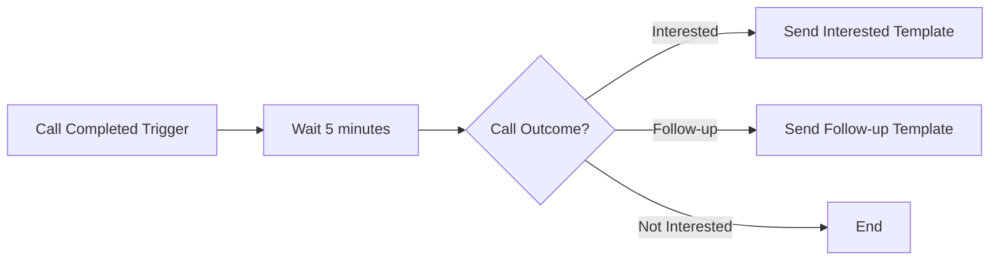
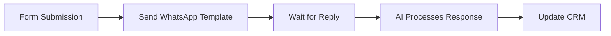
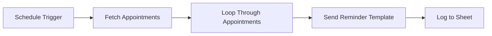

The automation platform integrates with WhatsApp to let you send messages automatically, trigger flows from WhatsApp events, and generate AI responses programmatically.

## Available Actions

### Send WhatsApp Template Message

Send a pre-approved template message to a customer.

**Use Cases:**
- Send order confirmations after a purchase
- Trigger appointment reminders on schedule
- Deliver follow-up messages after calls
- Re-engage customers who haven't responded

**Configuration:**

| Field | Description |
|-------|-------------|
| **Sender** | Select your WhatsApp sender (must be online) |
| **Template** | Choose from approved templates |
| **Recipient Phone** | Customer phone number (E.164 format: +1234567890) |
| **Recipient Name** | Optional customer name for personalization |
| **Variables** | Dynamic values for template placeholders |

<Tip>
**E.164 Format** — Phone numbers must be in international format with country code. Examples:
- ✅ `+14155551234`
- ✅ `+442071234567`
- ❌ `(415) 555-1234`
- ❌ `07123456789`
</Tip>

### Send WhatsApp Message (Free-form)

Send a free-form text message to a customer within the 24-hour messaging window.

<Warning>
**24-Hour Window Required** — Free-form messages can only be sent to customers who have messaged you within the last 24 hours. For customers outside this window, use a template message.
</Warning>

**Use Cases:**
- Send immediate follow-up to recent conversations
- Deliver time-sensitive information
- Respond to customer inquiries automatically

**Configuration:**

| Field | Description |
|-------|-------------|
| **Sender** | Select your WhatsApp sender |
| **Recipient Phone** | Customer phone number (E.164 format) |
| **Message** | Message content (max 4096 characters) |

### Generate AI Reply

Generate an AI response using your assistant, identified by an external customer identifier.

**Use Cases:**
- Build custom chat interfaces
- Integrate WhatsApp with external CRM systems
- Create multi-channel AI responses
- Process messages from external platforms

**Configuration:**

| Field | Description |
|-------|-------------|
| **Assistant** | Select the AI assistant to use |
| **Customer Identifier** | Unique customer ID (e.g., phone number, email, CRM ID) |
| **Message** | The message to respond to |
| **Variables** | Optional context variables for the assistant |

**How It Works:**
1. The action finds or creates a conversation for the customer identifier
2. Sends the message to your AI assistant
3. Returns the AI-generated response
4. You can then send this response via WhatsApp or other channels

## Triggers

### WhatsApp Message Received

Trigger a flow when a customer sends a WhatsApp message.

**Available Data:**
- Customer phone number
- Message content
- Sender ID
- Timestamp
- Conversation ID

**Example Use Cases:**
- Log messages to a CRM or database
- Send notifications to your team
- Trigger follow-up sequences
- Collect and process customer data

### WhatsApp Conversation Started

Trigger a flow when a new WhatsApp conversation begins.

**Available Data:**
- Customer phone number
- First message content
- Sender information
- Conversation ID

## Example Workflows

### Post-Call WhatsApp Follow-up

Send a WhatsApp template message after a call completes:



**Setup:**
1. Add **Call Completed** trigger
2. Add **Delay** action (optional)
3. Add **Branch** based on call outcome
4. Add **Send WhatsApp Template** action for each branch
5. Configure template and variables

### Lead Qualification via WhatsApp

Qualify leads through WhatsApp conversations:



### Appointment Reminder Flow

Send automated appointment reminders:



## Variable Mapping

When sending template messages, map your flow data to template variables:

**Template:**
```
Hi {{1}}, your appointment with {{2}} is confirmed for {{3}}.

Location: {{4}}
```

**Variable Mapping:**
| Template Variable | Flow Data |
|------------------|-----------|
| `{{1}}` | `{{trigger.customer_name}}` |
| `{{2}}` | `{{trigger.agent_name}}` |
| `{{3}}` | `{{trigger.appointment_date}}` |
| `{{4}}` | `{{trigger.location}}` |

## Error Handling

### Common Errors

| Error | Cause | Solution |
|-------|-------|----------|
| **Template not found** | Template ID invalid or not approved | Verify template is approved and ID is correct |
| **Sender offline** | WhatsApp sender is not online | Check sender status, ensure it's connected |
| **Invalid phone number** | Phone number not in E.164 format | Format as +[country code][number] |
| **Outside 24-hour window** | Trying to send free-form outside window | Use a template message instead |
| **Rate limited** | Too many messages sent | Implement delays between messages |

### Retry Strategy

For failed messages, implement a retry strategy:

1. Wait 1 minute
2. Retry the action
3. If still failing, log the error and notify your team

## Best Practices

### 1. Always Use Templates for Outbound

When initiating contact with customers, always use approved templates. Free-form messages only work within the 24-hour window.

### 2. Include Opt-Out Options

For marketing messages, include opt-out instructions to comply with regulations and maintain quality rating.

### 3. Respect Rate Limits

Don't send too many messages too quickly. Implement reasonable delays between batch sends.

### 4. Handle Errors Gracefully

Always add error handling to your flows. Log failures and notify your team of issues.

### 5. Test with Single Recipients First

Before running bulk campaigns, test your flow with a single recipient to verify everything works correctly.

### 6. Monitor Quality Rating

Keep an eye on your sender's quality rating. Pause campaigns if you notice declining quality.

## Next Steps

- Learn about [message templates](/whatsapp/templates) and how to create them
- Set up [WhatsApp senders](/whatsapp/senders) for your phone numbers
- Explore the [automation platform](/automation-platform/introduction) for more workflow options
