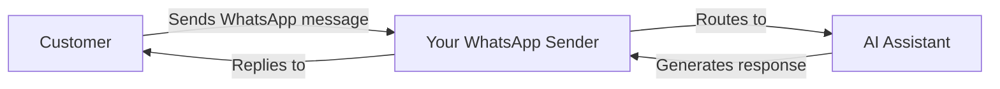

<Note>
**New: External Numbers** — You can now bring your own mobile number to WhatsApp! Use platform numbers or connect your existing mobile number with SMS/voice verification.
</Note>

## What is WhatsApp Business Integration?

WhatsApp Business integration allows you to connect your AI assistants to WhatsApp, enabling automated text-based conversations with customers through the world's most popular messaging platform.

With this integration, you can:

- **Receive customer messages** and respond automatically with AI
- **Send template messages** to start conversations or re-engage customers
- **Use AI-powered replies** for 24/7 customer support
- **Trigger automation flows** based on WhatsApp conversations
- **Track all conversations** in your dashboard

## How It Works

1. **Create a WhatsApp Sender** using a platform number or your own external number
2. **Connect an AI Assistant** to handle incoming messages automatically
3. **Create Message Templates** for outbound conversations (required by Meta)
4. **Customers message you** and receive AI-powered responses instantly

## Key Components

<CardGroup cols={2}>
  <Card title="WhatsApp Senders" icon="phone" href="/whatsapp/senders">
    Phone numbers registered for WhatsApp Business messaging
  </Card>
  <Card title="Message Templates" icon="file-lines" href="/whatsapp/templates">
    Pre-approved message formats for business-initiated conversations
  </Card>
  <Card title="AI Conversations" icon="robot" href="/whatsapp/conversations">
    AI-powered automated responses to customer messages
  </Card>
  <Card title="Automation" icon="bolt" href="/whatsapp/automation">
    Trigger flows and send messages via the automation platform
  </Card>
</CardGroup>

## Understanding WhatsApp Business Rules

WhatsApp has specific rules for business messaging that you need to understand:

### The 24-Hour Messaging Window

<Info>
When a customer messages you, a **24-hour window** opens where you can send free-form messages. After this window closes, you must use an **approved template** to re-engage the customer.
</Info>

- **Within 24 hours**: Send any message directly
- **After 24 hours**: Must use a pre-approved template message

### Template Messages

Template messages are pre-approved message formats required for:

- Starting new conversations with customers
- Re-engaging customers after the 24-hour window
- Sending notifications, updates, or marketing messages

Templates must be submitted to Meta for approval before use (typically takes minutes to 24 hours).

### Quality Rating & Limits

Meta monitors your messaging quality. New senders start with limited messaging capacity that increases as you maintain good quality:

| Quality Level | Daily Message Limit |
|--------------|---------------------|
| New Sender   | ~250 messages       |
| Low Quality  | 1,000 messages      |
| Medium       | 10,000 messages     |
| High Quality | 100,000+ messages   |

<Warning>
High block rates or spam reports will lower your quality rating and reduce your messaging limits. Always send relevant, requested content.
</Warning>

## Supported Features

### What's Supported

- **Platform numbers** — Use numbers purchased through our platform with automated AI verification
- **External numbers** — Bring your own mobile number and verify via SMS or voice call
- AI-powered automated replies
- Template messages (Utility, Marketing, Authentication)
- Voice Call Request templates (request permission to call via WhatsApp)
- Conversation history and tracking
- Automation platform integration

### Coming Soon

- Media attachments (images, documents, audio)
- WhatsApp voice calls

## Getting Started

<Steps>
  <Step title="Choose Your Number Type">
    Decide whether to use a **platform number** (purchased from us) or your own **external mobile number**. External numbers must be able to receive SMS or voice calls for verification.
  </Step>
  <Step title="Create a WhatsApp Sender">
    Navigate to **WhatsApp Senders** and follow the setup wizard to connect your number to WhatsApp Business.
  </Step>
  <Step title="Connect an AI Assistant">
    Link an AI assistant to automatically respond to incoming messages.
  </Step>
  <Step title="Create Templates">
    Set up message templates for outbound conversations and wait for Meta approval.
  </Step>
  <Step title="Start Messaging">
    Your WhatsApp sender is ready! Customers can message you and receive AI-powered responses.
  </Step>
</Steps>

## Next Steps

- Learn how to [create WhatsApp senders](/whatsapp/senders)
- Understand [message templates](/whatsapp/templates) and approval process
- Set up [automation triggers](/whatsapp/automation) for WhatsApp
