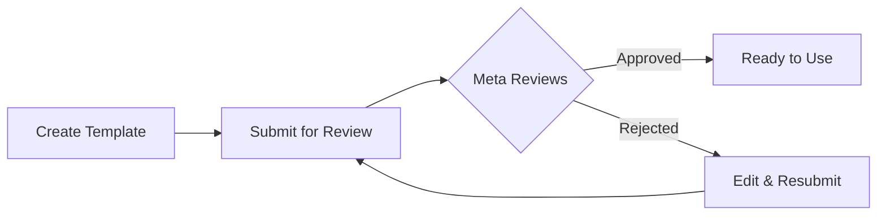

Message templates are pre-approved message formats required by Meta for business-initiated conversations on WhatsApp. You must have approved templates before you can send outbound messages to customers.

## What are Message Templates?

Message templates are structured messages that:

- Must be submitted to Meta for approval before use
- Allow you to start conversations with customers
- Can include variables for personalization
- Are required for messaging outside the 24-hour window

<Info>
**Why Templates?** — WhatsApp requires templates to prevent spam and ensure businesses send valuable, relevant messages to customers. All business-initiated messages must use approved templates.
</Info>

## When Do You Need Templates?

| Scenario | Template Required? |
|----------|-------------------|
| Customer messages you first | No — free-form reply allowed within 24 hours |
| Replying within 24 hours | No — send any message |
| Starting a new conversation | **Yes** |
| Re-engaging after 24 hours | **Yes** |
| Sending notifications/updates | **Yes** |
| Marketing messages | **Yes** |

## Template Categories

Templates are organized into categories that determine their approval requirements and use cases:

### Utility Templates

Transactional and service-related messages.

**Use for:**
- Order confirmations
- Shipping updates
- Appointment reminders
- Account notifications
- Payment receipts

**Approval:** Usually approved within minutes

### Marketing Templates

Promotional and sales-related messages.

**Use for:**
- Promotional offers
- Product announcements
- Newsletters
- Sales campaigns
- Re-engagement messages

**Approval:** May take longer, stricter review

<Warning>
**No Cross-Category Content** — Do not include promotional content in Utility templates. Meta will reject templates with mismatched category and content.
</Warning>

### Authentication Templates

Verification and security messages.

**Use for:**
- One-time passwords (OTP)
- Verification codes
- Login confirmations
- Security alerts

**Approval:** Standard review

### Voice Call Request Templates

Special templates to request permission for WhatsApp voice calls.

**Use for:**
- Requesting permission to call customers via WhatsApp voice
- Must include a voice call request button

**Approval:** Automatic (when using standard format)

## Creating a Template

### Step 1: Navigate to Templates

1. Go to **WhatsApp Senders** → Select your sender → **Templates** tab
2. Or go to **WhatsApp Templates** directly
3. Click **Create Template**

### Step 2: Configure Basic Settings

| Field | Description |
|-------|-------------|
| **Name** | Unique identifier (lowercase, underscores only). Example: `order_confirmation_v1` |
| **Category** | Select Utility, Marketing, Authentication, or Voice Call Request |
| **Language** | Template language (must match the content) |

<Tip>
**Naming Best Practices:**
- Use descriptive names: `appointment_reminder`, `order_shipped`
- Include version numbers: `welcome_message_v2`
- Avoid generic names: ~~`template1`~~, ~~`test`~~
</Tip>

### Step 3: Write Template Content

Templates can include multiple components:

#### Header (Optional)
- **Text Header**: Short headline (up to 60 characters)
- **Media Header**: Image, video, or document (coming soon)

#### Body (Required)
The main message content. This is where you write your message.

**Using Variables:**
Use `{{1}}`, `{{2}}`, etc. for dynamic content:

```
Hi {{1}}, your order {{2}} has been shipped!

Expected delivery: {{3}}
Track your package: {{4}}
```

<Info>
**Sample Values** — When creating templates, you must provide sample values for each variable. These help Meta understand your template's purpose and are required for approval.
</Info>

#### Footer (Optional)
A short line at the bottom (up to 60 characters). Often used for opt-out info or disclaimers.

#### Buttons (Optional)
Add interactive buttons to your template:

- **Quick Reply**: Pre-defined response buttons (e.g., "Yes", "No", "Learn More")
- **Call to Action**: Link to website or phone number
- **Voice Call Request**: Button to request voice call permission

### Step 4: Submit for Approval

1. Review your template content
2. Click **Submit for Approval**
3. Template status changes to "Pending Approval"
4. Wait for Meta review (minutes to 24 hours)

## Template Approval Process



### Approval Times

| Category | Typical Time |
|----------|-------------|
| Utility | Minutes to a few hours |
| Marketing | Hours to 24 hours |
| Authentication | Minutes to a few hours |
| Voice Call Request | Usually instant |

### Template Statuses

| Status | Description |
|--------|-------------|
| <span style={{color: '#6b7280'}}>**Draft**</span> | Not yet submitted |
| <span style={{color: '#f59e0b'}}>**Pending**</span> | Submitted, awaiting Meta review |
| <span style={{color: '#22c55e'}}>**Approved**</span> | Ready to use |
| <span style={{color: '#ef4444'}}>**Rejected**</span> | Review failed, see rejection reason |
| <span style={{color: '#6b7280'}}>**Disabled**</span> | Disabled by Meta due to low quality |

## Common Rejection Reasons

Avoid these common mistakes to improve your approval rate:

### ❌ Promotional Content in Utility Templates

**Problem:** Including discounts, offers, or marketing language in Utility templates.

**Solution:** Use Marketing category for promotional content.

### ❌ Missing or Unclear Variable Samples

**Problem:** Variables like `{{1}}` without clear sample values.

**Solution:** Provide realistic sample values that show the variable's purpose:
- ✅ `{{1}}` = "John Smith"
- ✅ `{{2}}` = "#12345"
- ❌ `{{1}}` = "test"

### ❌ Aggressive or Threatening Language

**Problem:** Content that could be perceived as harassment, threats, or spam.

**Solution:** Use professional, friendly language. Focus on value to the customer.

### ❌ URL Shorteners

**Problem:** Using bit.ly, tinyurl, or other URL shorteners.

**Solution:** Use full, branded URLs from your domain.

### ❌ Incorrect Category Selection

**Problem:** Choosing the wrong category for your content type.

**Solution:** Match category to content purpose strictly.

### ❌ Restricted Content

**Problem:** Templates about alcohol, gambling, adult content, political messaging, or illegal activities.

**Solution:** These are not allowed. Review Meta's commerce policies.

## Using Templates

### Sending Template Messages

Once approved, you can send template messages:

1. **Via Automation Platform**: Use the "Send WhatsApp Template" action
2. **Via API**: Call the send endpoint with template ID and variables

### Variable Replacement

When sending, replace variables with actual values:

**Template:**
```
Hi {{1}}, your appointment is confirmed for {{2}} at {{3}}.
```

**Sent Message:**
```
Hi John, your appointment is confirmed for January 15th at 2:00 PM.
```

## Best Practices

### 1. Use Descriptive Names

```
✅ order_confirmation_v1
✅ appointment_reminder
✅ shipping_update_with_tracking
❌ template1
❌ test
❌ message
```

### 2. Keep Messages Concise

WhatsApp users expect quick, clear messages. Get to the point and include a clear call-to-action.

### 3. Use Interactive Buttons

Add Quick Reply or Call-to-Action buttons to make it easy for customers to respond:

- "Track Order"
- "Contact Support"
- "View Details"
- "Confirm Appointment"

### 4. Test Before Bulk Sending

Always test your template with a single recipient before sending to a large audience. This helps catch formatting issues.

### 5. Create Templates Early

Approval can take up to 24 hours. Create and submit templates before you need them.

### 6. Have Backup Templates

Create multiple versions of important templates. If one is rejected or disabled, you have alternatives ready.

## Editing Templates

<Warning>
**Limited Editing** — Once a template is approved, you cannot edit it. To make changes, you must create a new template with a different name.
</Warning>

**Can Edit:**
- Draft templates (not yet submitted)
- Rejected templates (fix issues and resubmit)

**Cannot Edit:**
- Approved templates
- Pending templates (must wait for review)

## Template Limits

Meta enforces limits on template creation:

- Maximum templates per WhatsApp Business Account: Varies by account tier
- Template names must be unique per sender
- Rejected templates count toward your limit

## Next Steps

- Set up [automation triggers](/whatsapp/automation) to send templates automatically
- Learn about [WhatsApp senders](/whatsapp/senders) and sender management
- Review [AI assistant configuration](/ai-assistants/what-is-ai-assistant) for conversation responses
